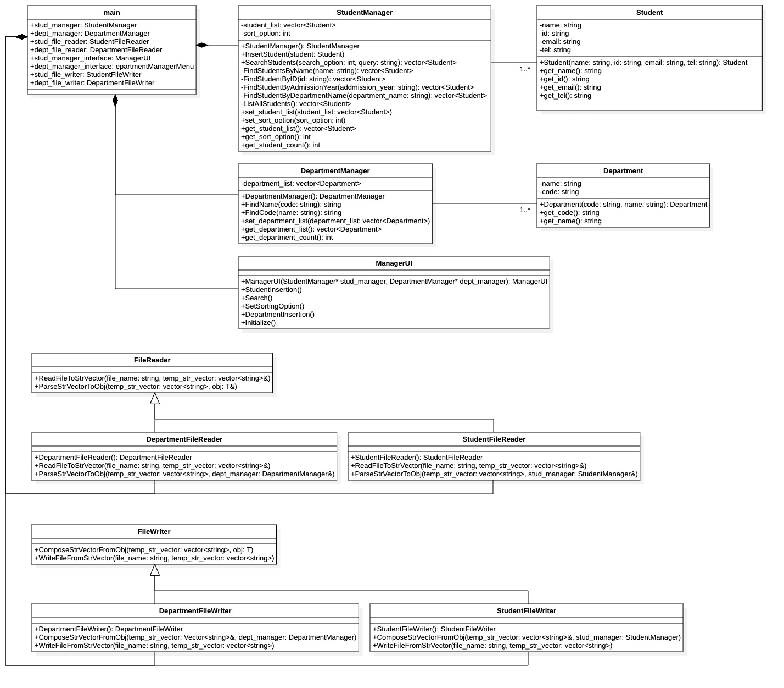

# Project 1 Documentation

### Diagram

### [class Student](Student.md)

Definition of a **student** in the program.

### [class StudentManager](StudentManager.md)

Manages instantiated `Student` objects in the program.

### [class Department](Department.md)

Definition of a **department** in the program.

### [class DepartmentManager](DepartmentManager.md)

Manages instantiated `Department` objects in the program.

### [class StudentFileReader](StudentFileReader.md)

Reads **student data** using external file.

### [class DepartmentFileReader](DepartmentFileReader.md)

Reads **department data** using external file.

### [class StudentFileWriter](StudentFileWriter.md)

Writes **student data** using external file.

### [class DepartmentFileWriter](DepartmentFileWriter.md)

Writes **department data** using external file.

### [class FileReader](FileReader.md)

**Parent class** of `StudentFileReader` and `DepartmentFileReader`.

### [class FileWriter](FileWriter.md)

**Parent class** of `StudentFileWriter` and `DepartmentFileWriter`.

### [class ManagerUI](ManagerUI.md)

User Interface between `User` and `Manager`.
